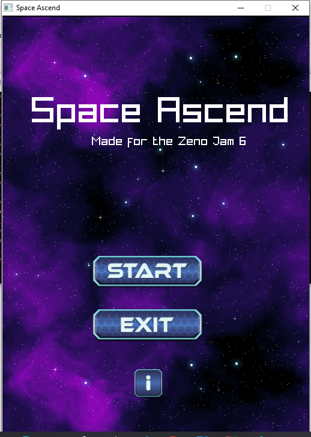
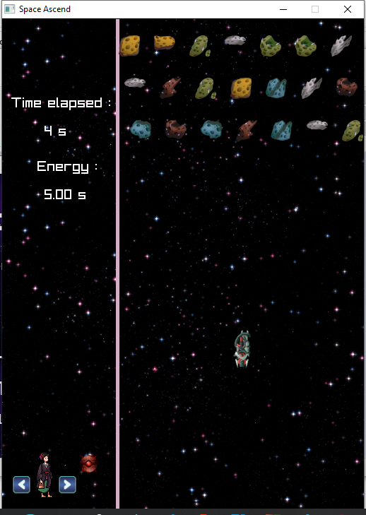
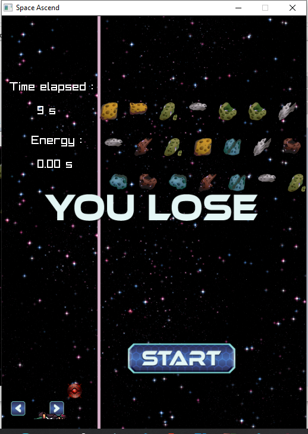

# Space Ascend

A  game made for the [Zeno Jam 6](https://itch.io/jam/zeno-jam-6)

## Theme : Going Up

### How is the theme implemented:

We basically made a space shooter, where you must keep going up, other ways gravity will pull you down.
You controll a ship, you must use it to destroy all the meteors. You loose when the it fall down out of the screen.

### Project genesis:

Throughout the year, I made shooters, a pacman, run and jump games, but not fighting ones. I wanted to make a fighting game, or at least start learning to make them. I tried to do one last month in a game jam, I wanted to make a Street Fighter clone, it ended up too much work for me, so I simplified the gameplay to a projectile exchange.  
I thought I would finally make it in this jam, but I've not mastered Raylib enought for that, so I've made a kind of workaround, there is a ninja hitting a box/button in order to make a ship go up and keep going up. The fight mechanic serves here to hit a button.

### Language : C

### Framework : Raylib

### Play on itch.io: [https://senor16.itch.io/space-ascend](https://senor16.itch.io/space-ascend)

### Controls :

Arrow keys and  WASD, to move  
I  to make the ship go up  
J to shoot at meteors

### Code : [Senor16](https://senor16.itch.io)

### Music : [Kneezuz](https://kneezus.itch.io)

### Graphics :

- Character : Free ninja sprites - Kunoichi - https://Craftpix.net
- Background : Screaming Brain Studios

### Development duration : 16h

### Screenshots:

  

